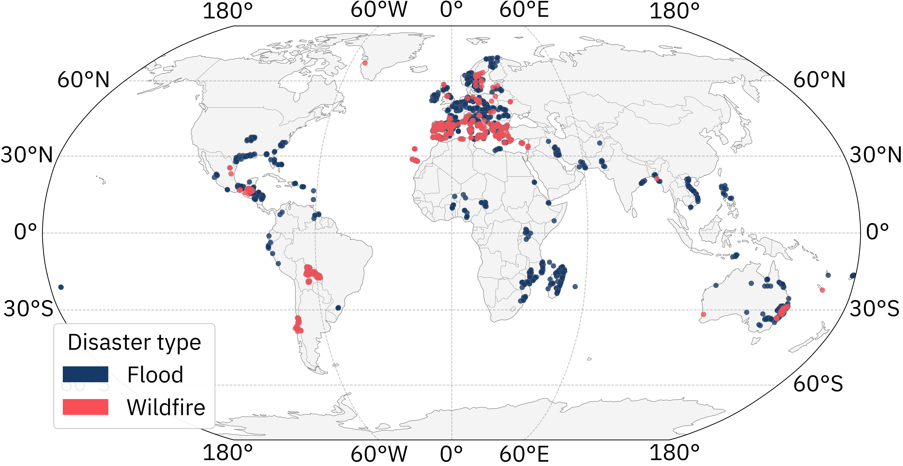

[](https://arxiv.org/abs/todo)
[](https://huggingface.co/datasets/ibm-esa-geospatial/ImpactMesh-Fire)
[](https://research.ibm.com/blog/todo)

# ImpactMesh

ImpactMesh is a large-scale multimodal, multitemporal dataset for flood and wildfire mapping, released by IBM, DLR, and the ESA Φ-lab. 
It combines Sentinel-1 SAR, Sentinel-2 optical imagery, and Copernicus DEM with high-quality annotations from Copernicus EMS. 
The dataset covers over 400 events globally with four temporal observations per event.

## Dataset

Please find the wildfire subset at https://huggingface.co/datasets/ibm-esa-geospatial/ImpactMesh-Fire and the flood samples at https://huggingface.co/datasets/ibm-esa-geospatial/ImpactMesh-FLood.
The following map gives an overview of events present in ImpactMesh:

<picture>
  <source media="(prefers-color-scheme: dark)" srcset="assets/events_world_dark.png">
  <source media="(prefers-color-scheme: light)" srcset="assets/events_world_light.png">
  
</picture>

This repository provides code to build the pytorch dataloader or directly fine-tune a model with [TerraTorch](https://terrastackai.github.io/terratorch/stable/).

## Setup

Quick start from pypi:
```shell
pip install impactmesh
```

Alternatively create a new environment and install TerraTorch and the package from source:
```shell
python -m venv venv
source venv/bin/activate
pip install --upgrade pip
pip install terratorch==1.2.1
pip install zarr==2.18.0 numcodecs==0.15.1
pip install -e .
```

ImpactMesh uses Zarr Version 2.

## Fine-tuning

Run training using on of the configs provided in [configs/](configs).
```shell
terratorch fit --config configs/terramind_v1_tiny_impactmesh_fire.yaml
```

Run the evaluation on the test split.
```shell
terratorch test --config configs/terramind_v1_tiny_impactmesh_fire.yaml -- ckpt output/terramind_tiny_impactmesh_fire/1e-4/best_val_loss.ckpt
```

Run prediction with the following command:
```shell
terratorch predict -c configs/terramind_v1_tiny_impactmesh_fire.yaml --ckpt path/to/ckeckpoint.pt --predict_output_dir output/impactmesh_fire_predictions

# TerraTorch automatically uses a tiled inference. It might still lead to OOM errors. In that case, you can use:
python impactmesh/run_inference.py -c configs/terramind_v1_tiny_impactmesh_fire.yaml --ckpt path/to/ckeckpoint.pt --output_dir output/impactmesh_fire_predictions
```

## Citation

Our technical report is released soon!

[//]: # (If you use ImpactMesh in your research, please cite the [ImpactMesh]&#40;https://arxiv.org/abs/todo&#41; pre-print.)

[//]: # (```text)

[//]: # (@article{todo})

[//]: # (```)

## Acknowledgement

ImpactMesh was developed as part of the FAST‑EO project funded by the European Space Agency Φ‑Lab (contract #4000143501/23/I‑DT).

Sentinel-2 Level-2A data were downloaded from Microsoft Planetary Computer and are provided under Copernicus Sentinel license conditions (© European Union 2015–2025, ESA) (https://planetarycomputer.microsoft.com/dataset/sentinel-2-l2a).

Sentinel-1 Radiometrically Terrain Corrected (RTC) SAR data were retrieved from Microsoft Planetary Computer (calibrated to GRD and terrain-corrected using PlanetDEM) under Copernicus Sentinel license terms (© European Union 2014–2025) (https://planetarycomputer.microsoft.com/dataset/sentinel-1-rtc).

The DEM data is produced using Copernicus WorldDEM-30 © DLR e.V. 2010-2014 and © Airbus Defence and Space GmbH 2014-2018 provided under COPERNICUS by the European Union and ESA; all rights reserved.

Annotations were sourced from the Copernicus Emergency Management Service (© European Union, 2012–2025), available at https://emergency.copernicus.eu/.

## License

The code and models are release under Apache 2.0. The dataset is released under CC-BY 4.0.
